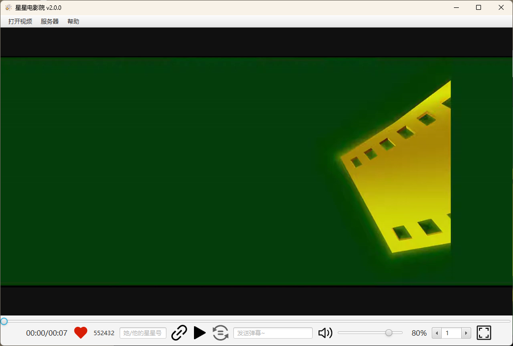
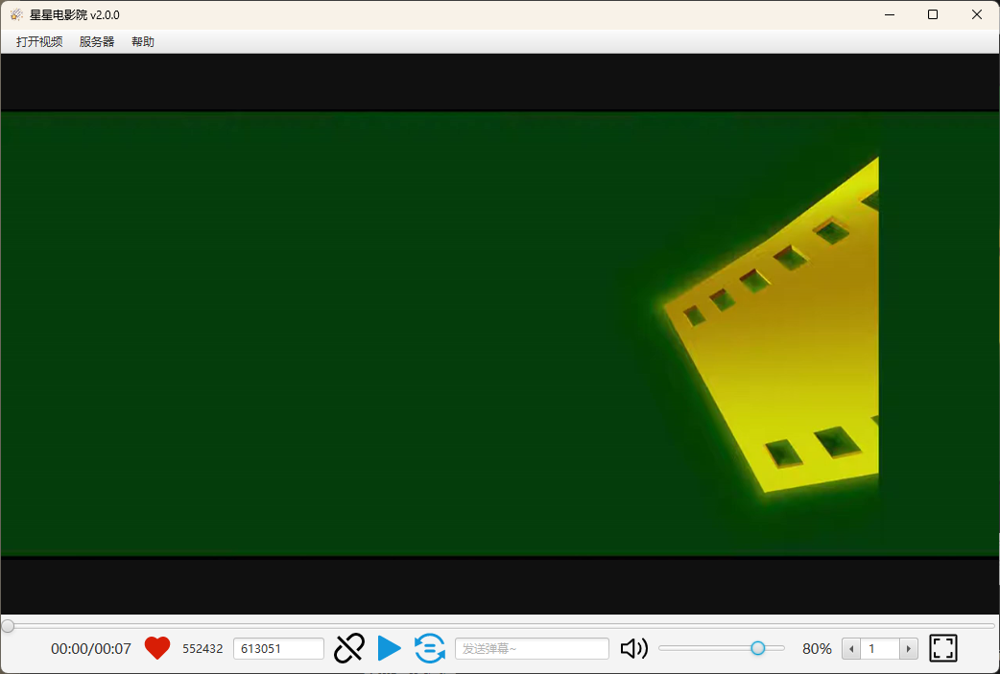
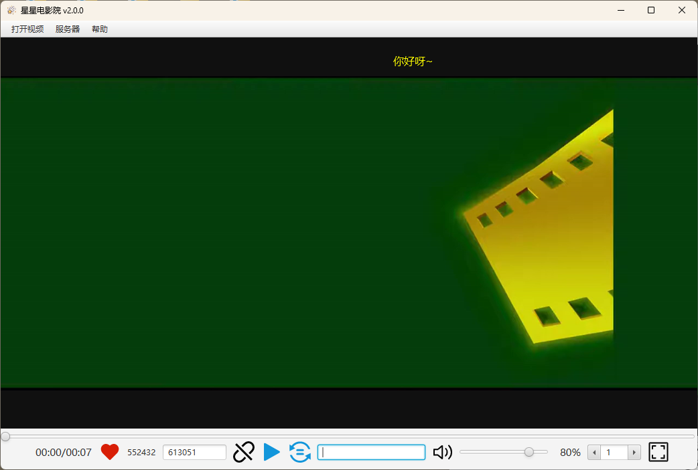
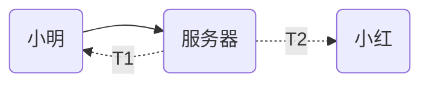

《星星同步播放器》是使用JavaFX开发的一款异地同时观看的电影的软件。

具有同步播放视频、同步暂停视频、实时弹幕互动等功能。

### 使用前置

软件使用了[VLC media player](https://www.videolan.org/)技术，可以播放绝大多数视频格式，但是需要提前安装好VLC播放器。软件打开会自动检测系统注册表是否安装VLC播放器，若没有安装则无法使用。请提前进入官网进行安装：

[VLC：官方网站 - 全平台的自由多媒体解决方案！ - VideoLAN](https://www.videolan.org/)

### 如何使用

在 Github 或者 Gitee 的发行版中下载最新版本

- https://github.com/tonydon140/star-movie/releases
- https://gitee.com/shuilanjiao/star-movie/releases

下载并解压压缩包，直接运行【StarSyncplayer.exe】即可。

打开软件会自动连接服务器，在左下角爱心右边会显示您自己的星星号，它是一个6位数字，点击星星号会自动复制到剪切板。在左上角点击【打开视频】进行选择视频。

在右侧的输入框中输入您的好朋友的星星号，点击右侧的连接图标，即可进行连接。

连接成功之后，播放按钮和同步按钮会变成蓝色。此时点击播放按钮则会和您的好朋友同时播放视频，点击同步按钮则会同步视频的进度和倍速。

可以在弹幕输入框输入文本进行发送弹幕，您发送的弹幕会实时在对方的视频中显示。

### 自定义服务器

目前该项目的默认服务器提供服务到2024年1月24日。

想自搭服务器的朋友可以参考`star-syncplayer-server`模块进行搭建。

然后软件的【服务器】菜单中断开服务器连接，然后连接自定义服务器即可。

### 视频格式

使用了 [VLC media player](https://www.videolan.org/) 技术，可以播放绝大部分视频格式文件。

### 延迟问题

《星星同步播放器》在设计上理论上延迟比较小。

举例说明：当小明点击同步播放或者一起播放时，小明的软件并不会立即播放，而是将播放指令转递到服务器，服务器收到指令后，同时发送播放指令给小明和小红。

假设服务器发送给小明的网络延迟为$t_1$，发送给小红的网络延迟为$t_2$。

那么小明和小红的播放延迟理论上为：$|t_1-t_2|$，远小于$t_1+t_2$的播放延迟。

### 项目模块介绍

| 模块                   | 描述                                                         |
| ---------------------- | ------------------------------------------------------------ |
| star-syncplayer-client | 使用 JavaFX 开发的客户端。                                   |
| star-syncplayer-common | client 和 server 之间使用的消息实体类                        |
| star-syncplayer-server | 基于 SpringBoot 的 WebSocket 服务端示例。 想自建服务器的朋友可以参考这个模块进行实现。 |
| star-websocket-client  | 模块化的 WebSocket 的客户端实现。基于 [Java-Websocket](https://github.com/TooTallNate/Java-WebSocket) |

