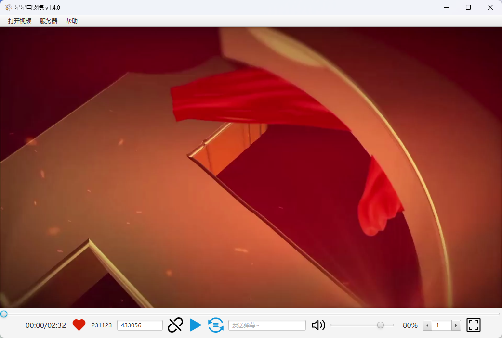
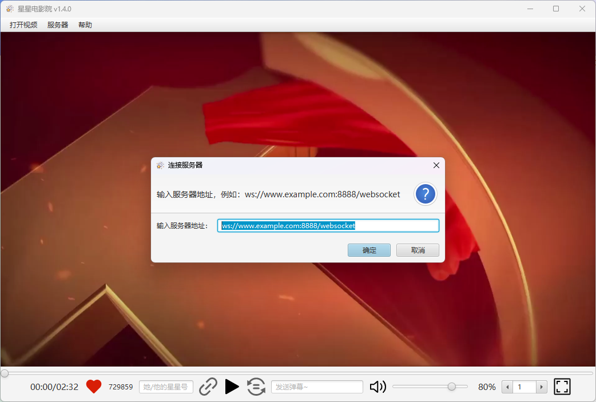

星星电影院，异地恋情侣双方可以同时控制播放电影的桌面/服务程序。

### 如何使用

解压压缩包，直接运行【StarSyncplayer.exe】即可。

打开软件会自动连接服务器，在左下角爱心右边会显示您自己的星星号，它是一个6位数字，点击星星号会自动复制到剪切板。在左上角点击【打开视频】进行选择视频。

在右侧的输入框中输入您的好朋友的星星号，点击右侧的连接图标，即可进行连接。

连接成功之后，播放按钮和同步按钮会变成蓝色。此时点击播放按钮则会和您的好朋友同时播放视频，点击同步按钮则会同步视频的进度和倍速。

可以在弹幕输入框输入文本进行发送弹幕，您发送的弹幕会实时在对方的视频中显示。

### 自定义服务器

想自搭服务器的朋友可以参考`star-syncplayer-server`模块进行搭建。

然后软件的【服务器】菜单中断开服务器连接，然后连接自定义服务器即可。

### 视频格式

支持的视频格式：由于 JavaFX 的限制，目前只支持 MP4 和 FLV 格式。

### 项目模块介绍

| 模块                   | 描述                                                         |
| ---------------------- | ------------------------------------------------------------ |
| star-syncplayer-client | 使用 JavaFX 开发的客户端。                                   |
| star-syncplayer-common | client 和 server 之间使用的消息实体类                        |
| star-syncplayer-server | 基于 SpringBoot 的 WebSocket 服务端示例。 想自建服务器的朋友可以参考这个模块进行实现。 |
| star-websocket-client  | 模块化的 WebSocket 的客户端实现。基于 [Java-Websocket](https://github.com/TooTallNate/Java-WebSocket) |

